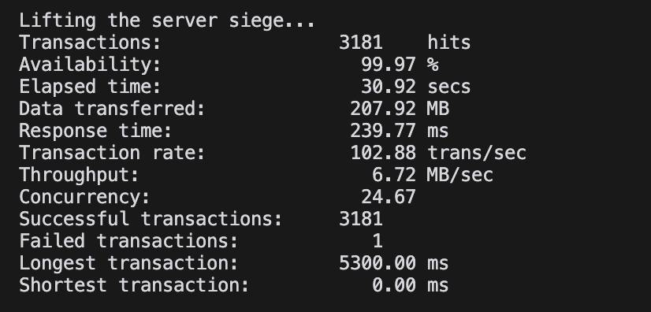
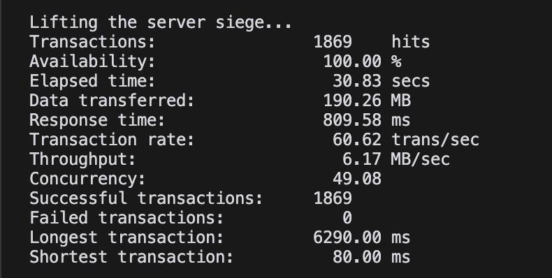
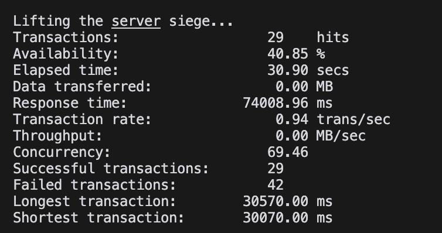
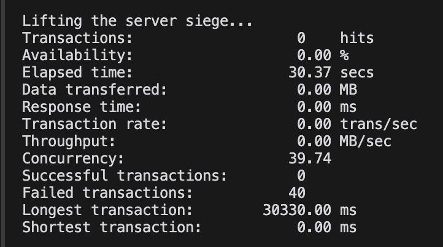

So i execute my siege-urls.txt files for 4 different concurrencies 

1.  siege -c 25 -t 30S -v -H 'Content-Type: application/json' -f siege-urls.txt
2.  siege -c 50 -t 30S -v -H 'Content-Type: application/json' -f siege-urls.txt
3.  siege -c 75 -t 30S -v -H 'Content-Type: application/json' -f siege-urls.txt
4.  siege -c 100 -t 30S -v -H 'Content-Type: application/json' -f siege-urls.txt

In my siege-urls.txt file i have 2 endpoints:

1.  POST /items
2.  GET /items

And i got the following results:

